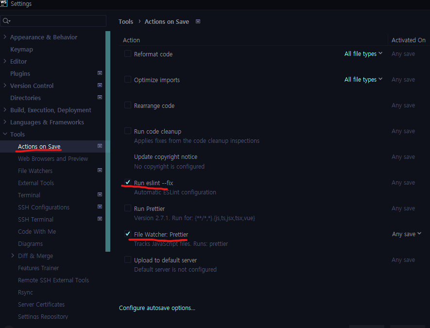

# Vdi 관리자 포탈
vue3 구축 VDI 관리자 포탈 

## Recommended IDE Setup

[VSCode](https://code.visualstudio.com/) + [Volar](https://marketplace.visualstudio.com/items?itemName=Vue.volar) (and disable Vetur) + [TypeScript Vue Plugin (Volar)](https://marketplace.visualstudio.com/items?itemName=Vue.vscode-typescript-vue-plugin).

## Customize configuration


See [Vite Configuration Reference](https://vitejs.dev/config/).

## Project Setup


```sh
npm install
```

### Compile and Hot-Reload for Development

```sh
npm run dev
```

### Compile and Minify for Production

```sh
npm run build
```

### Lint with [ESLint](https://eslint.org/)

```sh
npm run lint
```
### Project Directory Structure
```
src   
├── App.vue 
├── api // axios 모듈
|   └── index.js
├── assets // 스타일
|   ├── css
|   ├── font 
|   └── img 
├── commons // 공통 js
|   └── common.js 
├── router // router
|   └── index.js  // 라우터 설정
├── components // 공통 컴포넌트
|   ├── AppGrid.vue 
|   ├── AppGridTop.vue 
|   └── AppLoading.vue
├── composables //  상태 저장 논리 를 캡슐화하고 재사용하는 기능
├── directives // vue 속성 커스텀마이징
├── layout // Top, Footer등 고정 화면 레이아웃 
├── store // pinia 상태관리
|   └── index.js 
├── plugins // 외부 javascript 플러그인
├── utils // 공통 javascript
├── views // 개별 화면
└── main.js // vue 구동을 위한 기본 js 사용설정
```

### Eslint 설정
- File Watcher:Prettier는 없으면 설정 안해도됨.
- 저장(ctrl+S)하면 자동으로 코드스타일이 맞춰짐


### demo 서버 배포
1. npm run build
2. dist 폴더 압축 
3. /webRoot/portal/src 경로 dist 압축 해제 
```
scp -P 40023 {zip 경로이름} root@211.56.67.75:/home/demo-front/{zip이름}
ssh root@211.56.67.75 -p 40023
clwmrPfksakfdl@@
cd /home/demo-front
rm -rf ./dist
unzip ./{이름.zip}
/opt/apache-2.4.54/bin/apachectl -k restart
```
